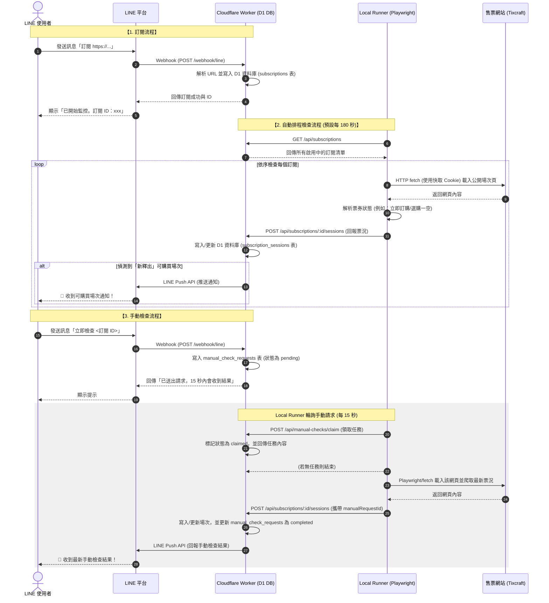

# Ticket Monitor

LINE Bot 訂閱式票券釋出通知服務。第一期支援 Tixcraft，日後可用相同介面擴充 Ticket Plus 與 Kham。

服務以 Chromium 讀取 Tixcraft 公開的場次選擇頁；不登入、不繞過驗證碼、不加入排隊、不進入選位或自動購票。支援無頭模式（Headless）並採用混合式 Cookie 快取技術，運作非常輕量。

## 訂閱管理

第一期用 LINE 對話指令管理，使用者加好友後直接貼活動網址即可。

- `訂閱 https://tixcraft.com/activity/detail/...`
- `我的訂閱`
- `取消 <訂閱 ID>`
- `說明`

當需要管理大量訂閱、場次／票價篩選或安靜時段時，再增加 LIFF 管理頁；現有資料庫與後端可沿用。

## 系統架構與資料流

服務採用 **Cloudflare Worker（中央控制與 API 服務）** 與 **Local Ticket Monitor（本地網頁抓取節點）** 的雙軌架構。

### 資料流快取設計
1. **第一次執行 / 快取失效**：執行端使用隱身防偵測設定啟動 Playwright 無頭瀏覽器訪問拓元，通過 WAF 挑戰並取得 10 個核心驗證 Cookie（如 `tmpt`、`eps_sid` 等）存入記憶體中，隨後自動關閉瀏覽器。
2. **後續輪詢**：直接使用原生 `fetch` 並帶上快取 Cookie 存取網頁，反應時間由 6 秒縮短至 **400ms**，並大幅降低伺服器 CPU/記憶體負擔。
3. **容錯機制**：當偵測到 WAF 401/403 阻擋或 Cookie 超期（50分鐘）時自動重新刷新；若 fetch 持續失敗，會自動降級回 Playwright 瀏覽器直連模式抓取，確保穩定度。

## Tixcraft 判定方式

活動網址會轉至公開場次頁 `/activity/game/<活動ID>`。

- 任一場次含「立即訂購」且未標示「選購一空」：`available`，發送 LINE 通知。
- 所有場次均標示「選購一空」：`unavailable`。
- 尚未開賣、載入失敗或無法判定：`unknown`，不發送通知。

預設每 180 秒檢查一次，程式強制最短 120 秒，避免對售票網站造成壓力。

## Windows 執行

1. 複製 `.env.example` 為 `.env`，填入 LINE token、secret 與資料庫設定。
2. 初次安裝瀏覽器：`npx playwright install chromium`。
3. 執行 `pnpm run build` 後以 `pnpm start` 啟動；開發時可用 `pnpm dev`。
4. 設定 LINE webhook：`https://你的公開 HTTPS 網域/webhook/line`。

服務預設使用無頭模式（Headless）運行，配合內建的 Cookie 快取機制，僅在首次或快取失效（每 50 分鐘）時會短暫啟動 Chromium 獲取驗證憑證，其餘輪詢皆以輕量 HTTP 請求執行。您可以安全地將 `PLAYWRIGHT_HEADLESS` 設為 `true` 於背景或伺服器中執行。

## 擴充供應商

在 `src/providers/` 新增 `TicketProvider` 實作並加入 `registry.ts`，既有的 LINE 指令、資料庫、通知與排程不用變更。
